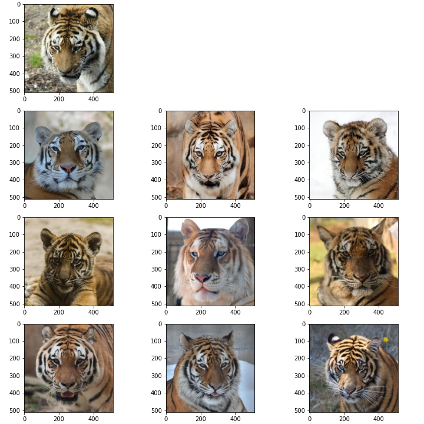
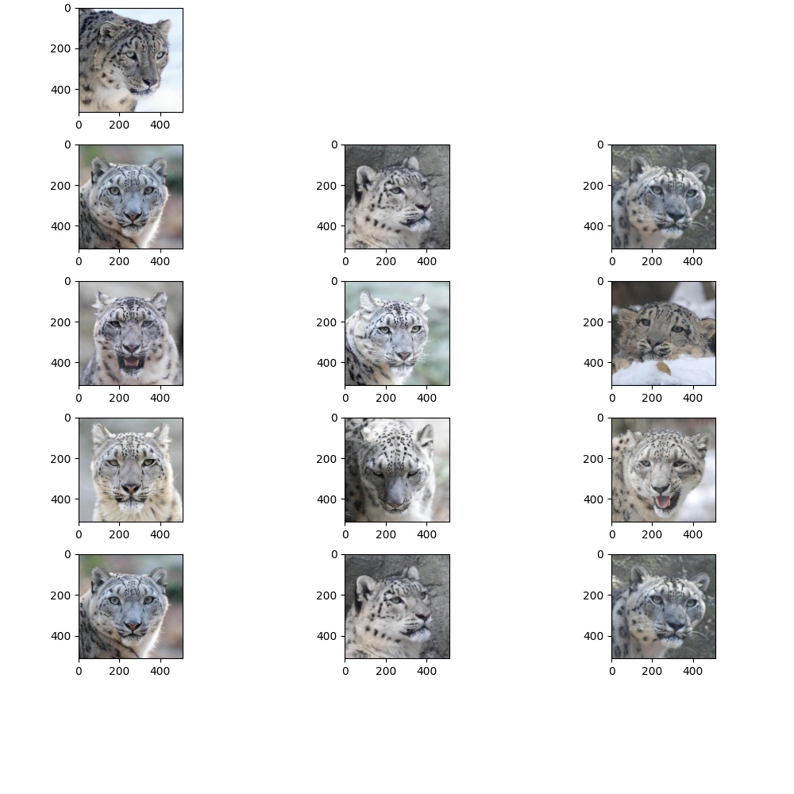
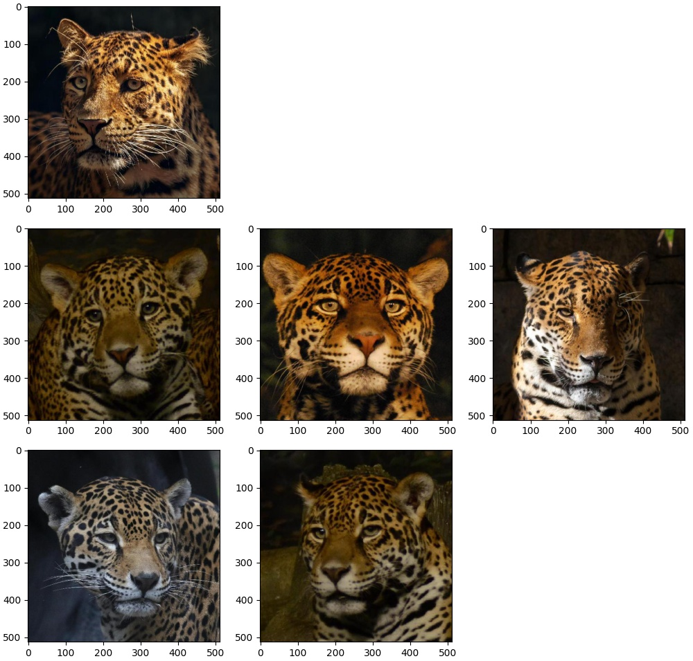

# Image Similarity on Animal Dataset

This project intends to extract similar images to the one as the query image.


    1. tsne_feature_extractor.py
This file takes image as input and using ResNet50 extracts feature vectors. These feature vectors are used to get TSNE coordinates, which are used to get clusters.	
 
    2. clustering.ipynb
In this notebook, clusters were found out using Kmeans and DBSCAN. Mainly DBSCAN was used, and Kmeans validated the clusters obtained using the former.

    3. similar_images_finder.py
Takes query image as input and outputs the most similar images obtained by “structural similarity” score.


To execute:
```
python similar_images_finder.py -q <input filepath> -n <number of images>
```
OR
```
python similar_images_finder.py --query <input filepath> --num_images <number of images>
```

Example_1:
```
python similar_images_finder.py --query images/0.jpg --num_images 9
```
Output:



Example_2:
```
python similar_images_finder.py --query images/8.jpg --num_images 16
```
Output:


Example_3:
```
python similar_images_finder.py --query images/7.jpg --num_images 9
```
(Here, only 5 similar images could be found)
Output:

